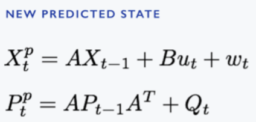
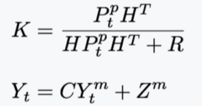
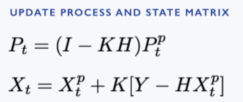
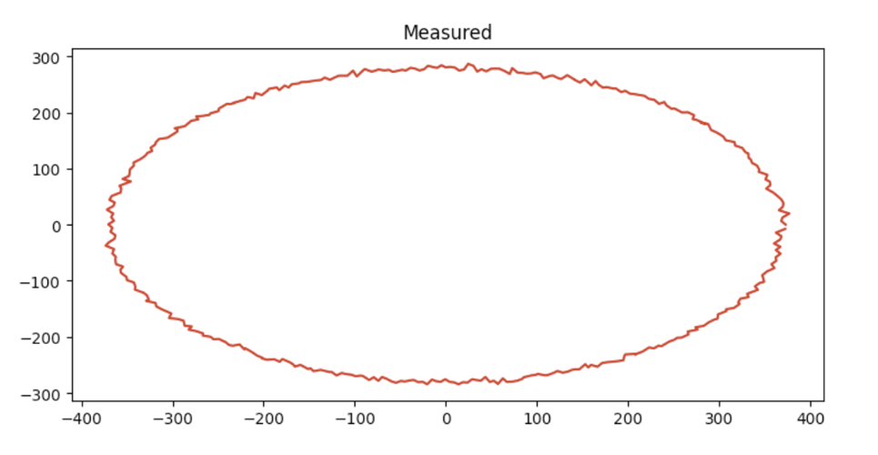
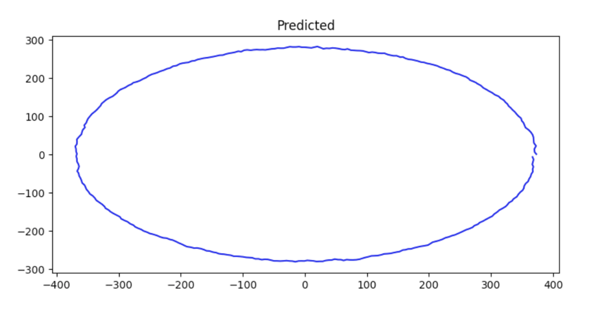
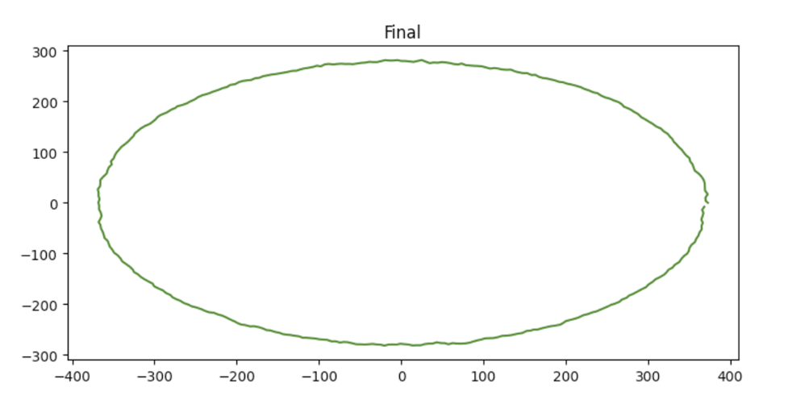
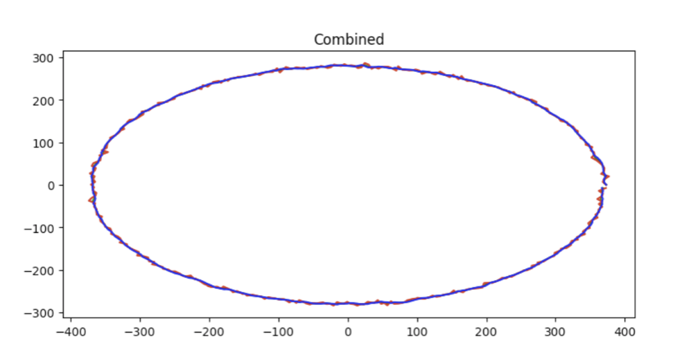
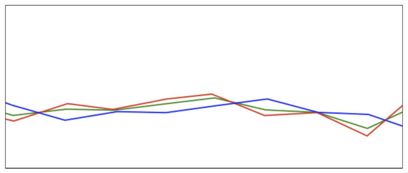

# Kalman Filter

Application of Standard Kalman Filter to estimate the Belief State of a vehicle and uncertainty associated with it.

## Algorithm

Kalman filter is applied in 2 Steps:

1. State Prediction
2. Measurement Update

`State Prediction` is done by relating previous state variables and applying mathematical formulation on them to predict the current state.

`Measurement Update` is done by combining both the predicted and measured state variables and estimating the best out of it.

In this way this Algorithm works in a recursive fashion, estimating the current state from the previous state.

### State Prediction



X(t) is the current state and P(t) is the current Covariance

- A matrix relates the previous state X(t-1) to the current state X(t)
- B is the control matrix that relates the control variable u with the state matrix X
- W and Q both are errors which can be carried during the prediction step.

Both X and P are having a subscript (p) which denotes that they are predicted variables.

`prediction` function returns a tuple containing predictedX and predictedP when provided with previousX and previousY according to the above mentioned algorithm.

### Measurement Update

First we calculate the Kalman Gain and Innovation Factor:



- K the Kalman Gain, signifies the relative weight need to be given to both predicted and
measured variables.
- Y the Innovation Factor, is the measured matrix calculated through measured variable Y
included with error Z.



- Finally, Updated P(t) and X(t) are calculated according to the calculated Kalman Gain

`updation` function returns updatedX and updatedY when provided with measuredX, predictedX and predictedP in accordance with the above mentioned algorithm.

In this way these sets of equations are applied recursively to estimate the final
State variables, Only when we are having X and P of previous state.

- State for X direction and Y direction are calculated separately i.e for a single iteration, we are having x and vx or y and vy in our X state matrice.
- `X_final` stores final belief state X coordinates and `Y_final` stores final belief state Y coordinates.

## Installation

```bash
python -m pip install -U matplotlib
git clone https://github.com/mradul2/kalman-filter.git
```

## Usage

```bash
python3 main.py
```

## Results

X vs Y Plots:









In the below picture, it is visible that Green line (Final estimated value) is between Blue line (Predicted value) and Red line (Measured Value):



- `main.py` contains the script to read data from kalman.txt, predict the state, update using data from measurement and finally plot it using pyplot.

- `kalman.txt` contains measured data from a sensor including 360 values of `x_position`, `y_position`, `x_velocity`, `y_velocity` of an Ego vehicle in a single line for each timstep.

- `BeliefState.txt` contains output of Kalman Filter Algorithm applied on kalmann.txt, file contains `x_position`, `y_position`, `x_velocity` and `y_velocity` in a single line for each timestep.

- `Uncertainty.txt` contains uncertainty predicted by Kalman Filter Algorithm, fIle contains uncertainty in order of `x_position`, `y_position`, `x_velocity`, `y_velocity` in a single line for each timestep.
